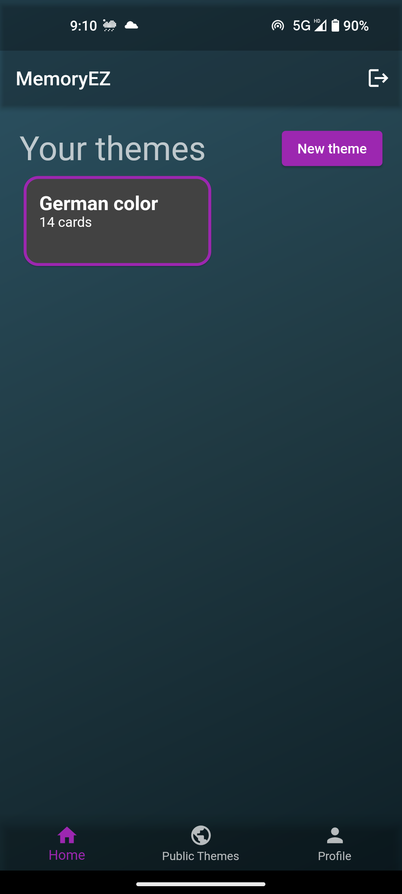

# memory_ez

Welcome to MemoryEz, a Flutter-based Android application that allows users to create, use, and learn flashcards. This app uses Firestore as its backend to store and manage user data.

## Features

* User authentication: Users can create an account, log in, and log out of the app.
* Create flashcards: Users can create flashcards with text and categorize them into themes.
* Theme creation: Users can create themes to group their flashcards together and share them with others if desired.
* Theme discovery: Users can browse themes created by other users.
* Flashcard learning: Users can practice flashcards by viewing or typing them one at a time, in random order.

## Future improvements

* Add resources to flashcards: add code, images, audio, and video to flashcards.
* Add options to learning mode: sequential, base side, etc...
* Add search functionality: search for themes and flashcards.
* Add sharing functionality: share themes and flashcards with specific users.

## Screenshots

## License

This project is licensed under the MIT License. See the LICENSE file for details.